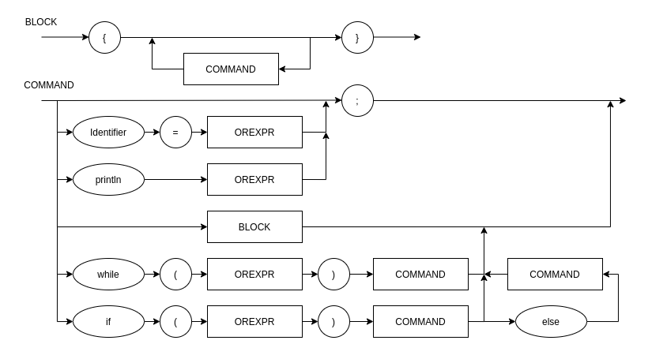
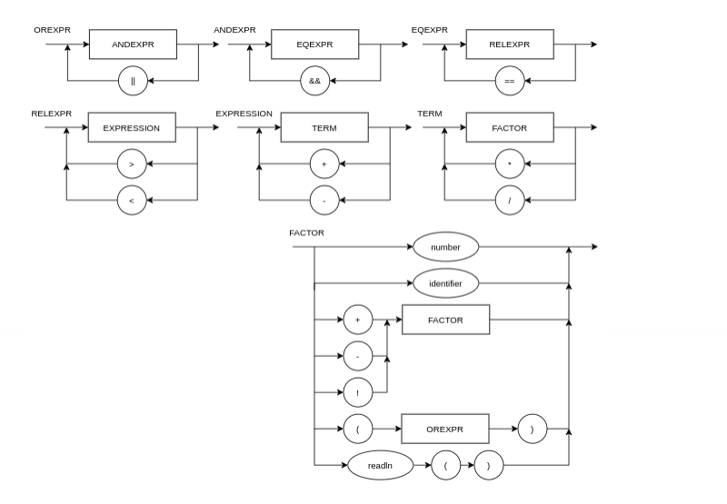

# 7-logica-da-computacao
Projeto Simple Calculator

# Status dos testes

# Diagrama sintático

# EBNF

BLOCK = "{", { COMMAND }, "}" ;

COMMAND = ( λ | ASSIGNMENT | PRINT | BLOCK | LOOP | CONDITION), ";" ;

ASSIGNMENT = IDENTIFIER, "=", OREXPR ;

PRINT = "println", "(", OREXPR, ")" ;

LOOP = "while", "(", OREXPR, ")", COMMAND ;

CONDITION= "if", "(", OREXPR, ")", COMMAND, ( λ | "else", COMMAND) ;

OREXPR = ANDEXPR, { "||", ANDEXPR } ;

ANDEXPR = EQEXPR, { "&&", EQEXPR } ;

EQEXPR = RELEXPR, { "==", RELEXPR } ;

RELEXPR = EXPRESSION, { (">" | "<"), EXPRESSION } ;

EXPRESSION = TERM, { ("+" | "-"), TERM } ;

TERM = FACTOR, { ("*" | "/"), FACTOR } ;

FACTOR = NUMBER | IDENTIFIER | (("+" | "-" | "!"), FACTOR) | "(", OREXPR, ")" | READ ;

READ = "readln", "(", ")";

IDENTIFIER = LETTER, { LETTER | DIGIT | "_" } ;

NUMBER = DIGIT, { DIGIT } ;

LETTER = ( a | ... | z | A | ... | Z ) ;

DIGIT = ( 1 | 2 | 3 | 4 | 5 | 6 | 7 | 8 | 9 | 0 ) ;
