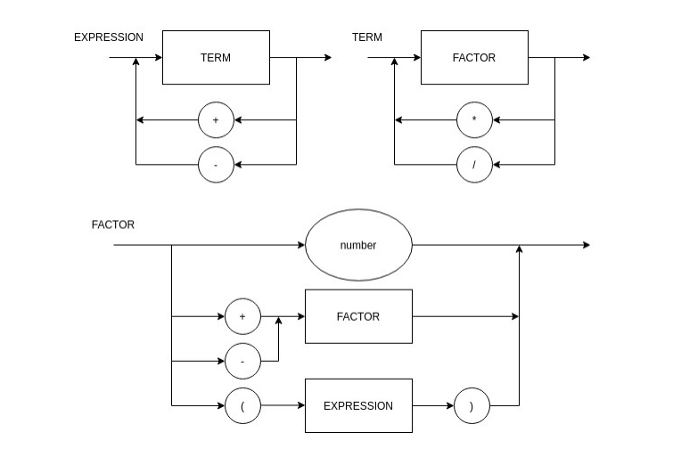

# 7-logica-da-computacao

Para utilizar o código você deve inserir a entrada como no exemplo do roteiro 0

# Diagrama sintático

# EBNF
EXPRESSION = TERM, { ("+" | "-"), TERM };

TERM = FACTOR, { ("*" | "/"), FACTOR };

FACTOR = ("+" | "-"), FACTOR | "(", EXPRESSION, ")" | number;
